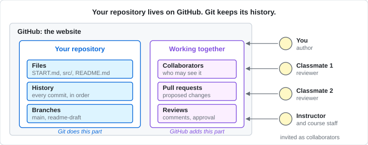
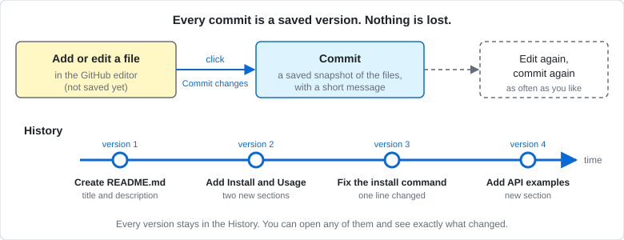
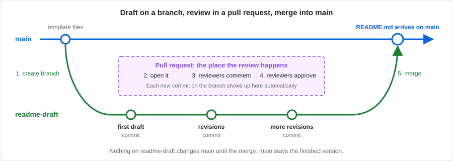
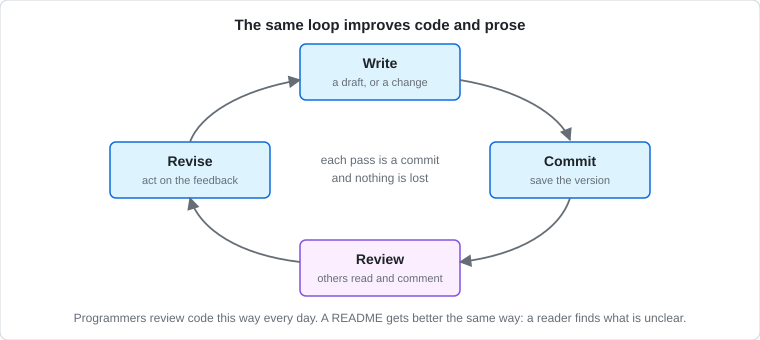
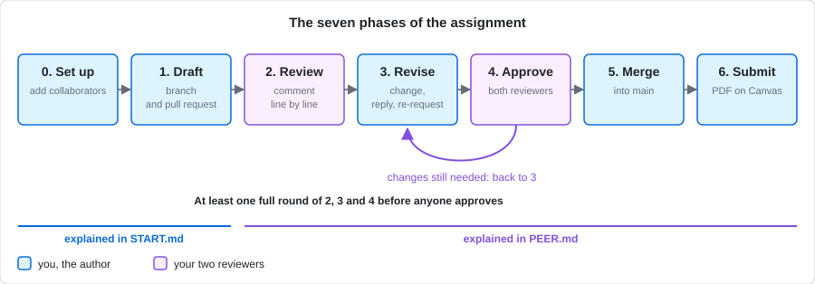

# Start here — tempo

## What a README is for

A README is the first file anyone reads in a repository. GitHub shows it on the repository's front page, under the list of files, so it is the project's front door: it tells a visitor what the project is, whether it is for them, how to install it, and how to use it. Most people who find a project never read its code. They read the README, and they decide in a minute or less whether to keep going. A project with no README, or a confusing one, gets closed in a browser tab, however good the code behind it is.

That is why the writing matters as much as the content. A README written in clear, precise, well-organized prose tells the reader that the project is cared for and can be trusted; one that is vague, padded, or wrong tells them the opposite, and they will assume the code is the same. The words you choose shape how a visitor understands the project: what they think it does, who they think it is for, and whether they think it is worth their time. Good writing is not decoration on top of the documentation. For most visitors, it is the project.

## Before you start: learn GitHub Markdown

A README is written in **Markdown**, a simple way of formatting plain text: a `#` at the start of a line makes a heading, `**bold**` makes **bold**, a line starting with `-` makes a bullet point, and text between backticks becomes `code`. GitHub uses its own version, called GitHub Flavored Markdown, which adds tables, task lists and a few other features.

**Before you write anything, read GitHub's guide:** [Basic writing and formatting syntax](https://docs.github.com/en/get-started/writing-on-github/getting-started-with-writing-and-formatting-on-github/basic-writing-and-formatting-syntax). Pay particular attention to headings, links (including links to sections of the same page, which you need for the Table of Contents), code blocks, and tables. If you want the full detail, the complete rules are in the [GitHub Flavored Markdown specification](https://github.github.com/gfm/), but the guide is enough for this assignment.

You can try Markdown out as you go: GitHub's editor has a **Preview** tab that shows how your text will look.

## What this project is

**tempo** is a command-line tool that tracks how much time you spend on
different projects. You start a timer with a tag, stop it when you're done, and
ask for a report later. It stores everything locally in a small database. It
can also be imported and driven from Python.

It was written by one developer for her own invoicing, and other people started
using it. It works. It has never had a README.

**Your job:** write that README.

## Who you are writing for

Someone who has just been told "try tempo" and has a terminal open. They have
not read the source. They will give the page about fifteen seconds before
deciding whether this is worth their afternoon.

Some of them will stop at the command line. A few will want to import it. Both
readers land on the same page.

## What's in this folder

| File | What it is |
|---|---|
| `pyproject.toml` | The packaging manifest: the install name, the dependencies, the command it creates |
| `src/tempo/__init__.py` | The public Python API: the `Tempo` class, what's exported, the version |
| `src/tempo/cli.py` | The command line: every subcommand and flag, the output, the error messages, and the developer's own comments |
| `src/tempo/storage.py` | The SQLite layer: where data lives, how the home directory is chosen, the running-session file |
| `src/tempo/reporting.py` | Aggregation and output formats, including the registry that lets you add your own |
| `src/tempo/timeparse.py` | Parsing of `--at`, `--since`, `--until` and durations; duration formatting |
| `issues.md` | Four issue threads from the tracker, with the maintainer's replies |
| `dev-chat.md` | A Slack thread between the two developers about why nobody can install it |
| `user-email.md` | An email from Petra, a researcher who spent forty minutes trying to get started |
| `SPEC.md` | The README specification for this assignment: the sections your README needs, in order |
| `images/` | Diagrams used in this file and in `PEER.md` |
| `PEER.md` | Phases 2 to 6: how your README is peer reviewed, revised, merged, and submitted |

## A reading order that works

1. **`pyproject.toml` first.** It is the shortest file and it tells you what
   the thing is called and what it installs. Two of those facts matter more
   than they look.
2. **`src/tempo/cli.py`.** This is the biggest file and the most important one.
   Read `build_parser()` for the full inventory of commands and flags, then the
   `cmd_*` functions for what each one actually prints. Read the comments as
   carefully as the code: the developer leaves notes to herself that are really
   notes to a user.
3. **`user-email.md`.** This is your reader, in their own words, telling you
   exactly where they got stuck. Everything Petra struggled with is a section
   of your README.
4. **`issues.md`.** Questions people ask more than once belong on the page.
   Look for the moment the maintainer says something should be in the docs.
5. **`src/tempo/__init__.py`**, for the API half. The module docstring and
   `__all__` tell you what is public and what is internal. Everything not in
   `__all__` is somebody else's business.
6. **`storage.py`, `reporting.py`, `timeparse.py`** as needed. You do not have
   to understand all of this, but when the CLI does something you can't explain
   from `cli.py` alone, the answer is in one of these three.
7. **`dev-chat.md` last.** The developers say out loud what they think is wrong
   with the onboarding. Treat it as a requirements list.

## Before you start writing

Answer these for yourself. If you cannot, go back to the material.

- What do you type to install it, and what do you type to run it?
- What is the very first thing a new user should do after installing?
- What are the two or three ways a new user is most likely to get stuck?
- Where does the data live, and how would someone move it?
- What can a Python caller do that a shell user can't, and vice versa?
- What does this tool *not* do, or not do reliably?

## What the README has to contain

**Follow [SPEC.md](SPEC.md).** It is this assignment's README specification,
adapted from the [Standard Readme spec](https://github.com/RichardLitt/standard-readme).
It lists the sections, in order: Title, an optional Banner, Description, Table
of Contents, Install, Usage, optional extra sections, API (required: this
project has one), Maintainers, and Credits. Read it before you start. It is
short, and it settles most of the arguments you would otherwise have with
yourself about what goes where.

**Include worked examples of both halves of the project.**

- *The CLI.* Several real invocations with the output they produce. Not only
  the happy path: show at least one thing going wrong and what the user does
  about it. An example a reader can paste is worth three paragraphs.
- *The library.* How to import it and use it from Python, and one example of
  extending it through the formatter registry.

Examples must be consistent with the source in this folder. If you are not
sure what a command prints, that is a sign to go back and read `cli.py` rather
than to make something up.

## Two rules

**Use only what is in this folder.** Do not invent features, flags, or
behaviour that the material doesn't support. If you find yourself guessing,
that guess is a question for the maintainer, not a sentence in the README.

**If something is genuinely unclear, say so.** "Not tested on Windows" is a
useful sentence. Silence is not.

## Git and GitHub, from the beginning

You do not need to have used Git or GitHub before. This section explains every idea the assignment uses, in the order you will meet them. Read it once now, and come back to the table at the end whenever a word is unfamiliar.

### Git and GitHub are two different things

**Git** is a tool that keeps track of changes to a set of files. Every time you save a version, Git records exactly what changed, who changed it, when, and why. It never throws an old version away, so you can always see how a file got to where it is, or go back to an earlier version. Programmers use it on nearly every software project in the world.

**GitHub** is a website that stores Git projects online and adds the things people need to work together on them: deciding who can see a project, proposing changes, and reviewing each other's work. You will use Git's ideas through GitHub's website, so you never have to install Git or type a command.

*GitHub holds your repository. Inside it, Git keeps the files, every saved version, and the branches. Around it, GitHub adds the people: collaborators, pull requests and reviews.*

### Repository

A **repository** (often shortened to *repo*) is one project's folder on GitHub: its files, plus the complete history of every change ever made to them. The project you are documenting is a repository. Yours is a private copy made from a **template**, a starting repository your instructor prepared, so nothing you do affects anyone else's copy.

### Adding a file and committing

On GitHub you add a new file, or edit an existing one, in an editor in your browser. While you type, nothing is saved yet. When you click **Commit changes**, GitHub saves a **commit**: a snapshot of your files at that moment, with a short **commit message** describing what you changed ("Add Install section", "Fix the install command").

You can commit as often as you like. Each commit is kept forever in the repository's **history**, so you can open any earlier version and see exactly which lines changed. A commit is not a final submission; it is closer to pressing save, except that every save is kept.

*Editing changes nothing until you commit. Each commit adds a new version to the history, and the earlier versions stay.*

### Branches

A **branch** is a separate line of work inside the same repository: a draft copy of the files where you can make changes without touching the original. Every repository starts with one branch called **main**, which holds the finished, official version.

In this assignment you write your README on a second branch called **readme-draft**. Your commits go there, and `main` stays exactly as it was until your README has been reviewed and approved.

### Pull requests

A **pull request** (often shortened to *PR*) is a request to bring the changes on one branch into another: here, from `readme-draft` into `main`. It is also where the review happens. A pull request has its own page on GitHub showing every change you made, line by line, with tabs for the discussion (**Conversation**), your saved versions (**Commits**) and the changes themselves (**Files changed**). Reviewers comment on individual lines there, and suggest exact wording.

When you commit more changes to `readme-draft`, they appear in the same pull request automatically. You open one pull request, and it collects the whole conversation.

### Reviews, approval and merging

A **review** is a reviewer's set of comments on a pull request, submitted together, with an overall verdict: **Comment**, **Request changes**, or **Approve**. When both your reviewers have approved, you **merge** the pull request: GitHub copies the changes from `readme-draft` into `main`. Your README is then part of the official version of the repository and appears on its front page.

*The whole workflow: create a branch, commit your draft, open a pull request, get reviews, commit revisions, and merge into `main` once both reviewers approve.*

### Why this works for writing as well as for code

Programmers rarely change important code alone. They make the change on a branch, open a pull request, and a colleague reads it before it is merged. The reviewer catches what the author cannot see, because the author already knows what they meant. The author revises, and the cycle repeats until the change is good.

Writing works the same way, and a README especially so: its whole job is to make sense to someone who is not you. A reviewer who tries to follow your install steps and gets stuck has found a real problem that you could not have found by rereading your own words. Branches, commits and pull requests make this loop easy: every draft is saved, every comment sits next to the line it is about, and every revision shows exactly what changed in response. That is why you will go through at least one full round of review and revision before your README is merged.

*The loop you will follow: write, commit, get it reviewed, revise, and go round again until it is ready.*

### Words you will meet

| Word | What it means here |
|---|---|
| Git | The tool that records every change to a project's files |
| GitHub | The website that stores your repository and lets people work on it together |
| Repository (repo) | A project's folder on GitHub: its files and their full history |
| Template | A starting repository; your repository is a private copy of one |
| Markdown | The simple formatting language a README is written in |
| Commit | A saved snapshot of the files, made when you click **Commit changes** |
| Commit message | The short description of what a commit changed |
| History | The list of every commit, oldest to newest |
| Branch | A separate line of work in the same repository |
| `main` | The branch that holds the finished, official version |
| `readme-draft` | The branch you write your README on |
| Pull request (PR) | A request to bring one branch's changes into another, and the page where they are reviewed |
| Files changed | The pull request tab that shows every changed line |
| Review | A reviewer's comments on a pull request, submitted together with a verdict |
| Suggestion | A review comment that proposes exact replacement text, which the author can accept with one click |
| Approve | A reviewer's verdict that the pull request is ready to merge |
| Request changes | A reviewer's verdict that something must change first |
| Resolve conversation | Marking a comment thread as dealt with |
| Merge | Bringing a branch's changes into `main` |
| Collaborator | Someone you have given access to your private repository |

## How the assignment runs

You do everything on the GitHub website, in your browser. Do not clone the repository or use another editor: every step is explained inside GitHub, so everyone works the same way, and course staff can only help with problems that happen there.

*The seven phases. Review, revise and approve repeat until both reviewers approve.*

| Phase | Who | What happens | Where it is explained |
|---|---|---|---|
| 0. Set up | You | Add your reviewers, instructor and course staff to your repository | Below, in this file |
| 1. Draft | You | Write `README.md` on a new branch and open a pull request | Below, in this file |
| 2. Review | Your reviewers | Comment on your README, line by line | [PEER.md](PEER.md) |
| 3. Revise | You | Make changes, answer every comment, ask for another review | [PEER.md](PEER.md) |
| 4. Approve | Your reviewers | Check the changes and approve | [PEER.md](PEER.md) |
| 5. Merge | You | Merge the pull request into `main` | [PEER.md](PEER.md) |
| 6. Submit | You | Convert `README.md` to a PDF and submit it on Canvas | [PEER.md](PEER.md) |

Phases 0 and 1 are below. When your pull request is open, continue with [PEER.md](PEER.md). You will also be a reviewer for two classmates, so read phases 2 and 4 of [PEER.md](PEER.md) before your first review.

Your instructor will tell you when drafts are due, who your reviewers are, and the GitHub usernames of the instructor and course staff.

### Phase 0: Set up

#### Add your reviewers, instructor and course staff

Your repository is private, so only the people you add can see it.

1. Go to your repository on GitHub.
2. Click **Settings** (the tab with the gear icon, at the top of the repository).
3. In the left sidebar, under **Access**, click **Collaborators**. GitHub may ask for your password.
4. Click **Add people**.
5. Type the person's GitHub username, choose them from the list, and click **Add to this repository**.
6. Repeat for each person: your two reviewers, your instructor, and each member of course staff.

Each person gets an invitation by email and on GitHub. They cannot see your repository until they accept it.

#### Accept invitations you receive

When a classmate adds you as a reviewer, you get an email from GitHub. Open it and click **View invitation**, then **Accept invitation**. You can also find invitations under the bell icon (top right of any GitHub page).

### Phase 1: Draft

#### Create README.md on a new branch

Do this once, to start the README.

1. Go to the front page of your repository (the **Code** tab). Check that the branch button near the top left says `main`.
2. Click **Add file**, then **Create new file**.
3. In the name box, type exactly `README.md`. It goes at the top level, next to this `START.md`, not inside `src/`. Leave every other file as it is: your README describes this code, it does not change it.
4. Write in the editor. Click the **Preview** tab at any time to see how it will look. Follow [SPEC.md](SPEC.md) for what goes in it, and the requirements in [What the README has to contain](#what-the-readme-has-to-contain) above.
5. Click the green **Commit changes...** button (top right).
6. In the box that opens:
   - Leave the commit message as it is, or write a short one such as "First draft of README".
   - **Choose "Create a new branch for this commit and start a pull request."** This is the important step: do not choose "Commit directly to the `main` branch".
   - In the branch name box, type `readme-draft`.
7. Click **Propose changes**.

GitHub now shows the **Open a pull request** page. Continue below.

#### Open the pull request

1. **Title:** something clear, such as "README for tempo".
2. **Description:** write it yourself, in a few sentences: what this README covers, anything you are unsure of, and what you would most like your reviewers to look at. See [Write the description yourself](#write-the-description-yourself) below.
3. On the right, click **Reviewers** (or the gear next to it) and choose your two reviewers. Only people who have accepted your invitation appear.
4. Click **Create pull request**.

Your pull request now has its own page, with tabs for **Conversation**, **Commits** and **Files changed**. Your reviewers get a notification.

#### Keep working on the draft

You can keep editing until your reviewers start, and you will edit again in phase 3. Always edit on the `readme-draft` branch:

1. Open your pull request: click the **Pull requests** tab of your repository, then your pull request.
2. Click the **Files changed** tab.
3. On the `README.md` box, click the **...** button (top right of the box), then **Edit file**.
4. Make your changes, then click **Commit changes...**.
5. Check that the box says **Commit directly to the `readme-draft` branch**, then click **Commit changes**.

The pull request updates on its own. You never need to open a second pull request.

#### Write the description yourself

GitHub may offer to write the pull request description for you with Copilot, its AI assistant, through a Copilot button or suggested text that appears as you type in the description box. **Do not use it.**

The description is your message to your reviewers: it tells them what you did and where to look. They take it on trust, so it has to say what you actually did, in your words. An AI summary of your changes can sound right while describing them wrongly, and your reviewers would then look in the wrong place.

- If suggested text appears as you type, you can switch it off: click the Copilot icon above the description box and choose **Disabled** under **Autocomplete**.
- If Copilot text ends up in your description anyway, read it against what you actually did, rewrite anything that is wrong or vague, and add a line at the end saying "Part of this description was written by Copilot and checked by me."

#### If you committed to main by mistake

If `README.md` went onto `main` instead of a new branch, there is nothing for your reviewers to review. Fix it like this:

1. Open `README.md` on `main`, select all the text in it, and copy it somewhere safe.
2. Click the **...** button (top right of the file), then **Delete file**, and commit directly to `main`.
3. Start again at [Create README.md on a new branch](#create-readmemd-on-a-new-branch) and paste your text back in.

When your pull request is open and your reviewers are requested, continue with phase 2 in [PEER.md](PEER.md).
